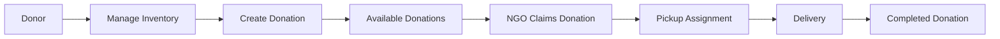
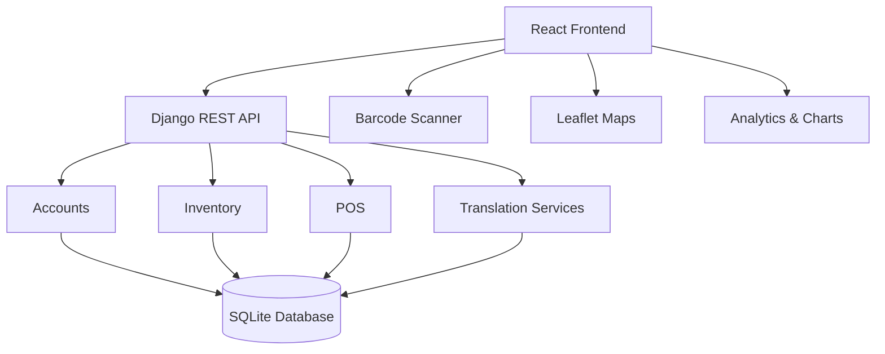

# AI-Based Food Redistribution System

> A full-stack platform for managing surplus food inventory, donations, claims, and delivery coordination to reduce food waste.

## 📌 Overview

The **AI-Based Food Redistribution System** is a web application designed to streamline surplus food management and redistribution.

The platform connects different participants involved in the food redistribution process and provides role-based functionality for managing inventory, donations, claims, pickups, deliveries, analytics, and reporting.

The system is built using a **React frontend** and **Django REST Framework backend**, with additional support for barcode scanning, maps, analytics, and multilingual/AI-assisted translation.

## ✨ Key Features

- 🍱 **Food Inventory Management** — Manage food products, quantities, and expiry information.
- 🤝 **Donation Management** — Create, manage, and track surplus food donations.
- 🏢 **Role-Based Dashboards** — Dedicated functionality for donors, NGOs, delivery personnel, and administrators.
- 🚚 **Pickup & Delivery Management** — Coordinate pickups, assignments, schedules, and completed deliveries.
- 📊 **Analytics & Reports** — Visualize inventory, donation, and transaction data.
- 📷 **Barcode Scanning** — Support barcode-based inventory workflows.
- 🗺️ **Map Integration** — Location-based functionality using Leaflet.
- 🌐 **Multilingual Support** — Internationalization and AI-assisted translation.
- 🔐 **JWT Authentication** — Token-based authentication for secure API access.

## 👥 User Roles

The system supports multiple types of users:

- **Commercial Donor**
- **Individual Donor**
- **NGO**
- **Delivery Personnel**
- **Administrator**

Each role has access to functionality relevant to its responsibilities.

## 🔄 System Workflow



## 🏗️ Architecture

The system follows a **client-server architecture**, where the React frontend communicates with the Django REST Framework backend through REST APIs.



### Architecture Components

- **Frontend:** React-based user interface for dashboards, inventory, donations, claims, deliveries, and other workflows.
- **Backend:** Django REST Framework provides APIs, authentication, business logic, and data management.
- **Database:** SQLite is used for storing application data during development.
- **Authentication:** JWT-based authentication is used for API access.
- **External Integrations:** Barcode scanning, Leaflet maps, analytics, and translation services extend the platform's functionality.

## 🛠️ Tech Stack

### Frontend

- **React.js**
- **React Router**
- **Axios**
- **Bootstrap**
- **React Leaflet**
- **Recharts**
- **i18next / React-i18next**
- **ZXing / Barcode Scanner**

### Backend

- **Python**
- **Django**
- **Django REST Framework**
- **Django REST Framework Simple JWT**

### Database

- **SQLite**

### Development Tools

- **Git & GitHub**
- **Visual Studio Code**
- **npm**
- **Python Virtual Environment**

## 🤖 AI & Intelligent Features

The platform includes AI-assisted functionality to improve accessibility and usability across the food redistribution workflow.

- 🌐 **AI-Assisted Translation** — Supports multilingual communication through translation services.
- 🗣️ **Multilingual Interface** — Enables users to interact with the platform in supported languages.
- 🔄 **Translation Service Integration** — The backend provides translation-related APIs for frontend integration.

## 📁 Project Structure

```text
AI-FOOD-REDISTRIBUTION-SYSTEM/
│
├── accounts/              # User authentication and account management
├── config/                # Django project configuration
├── inventory/             # Food inventory management
├── pos/                   # Donation and transaction-related functionality
├── translator/            # Translation services and APIs
│
├── frontend/              # React frontend application
│   ├── public/
│   └── src/
│       ├── components/
│       ├── context/
│       ├── hooks/
│       ├── pages/
│       ├── services/
│       ├── styles/
│       └── utils/
│
├── manage.py              # Django management utility
├── requirements.txt       # Python dependencies
├── package.json           # Project-level npm configuration
└── README.md              # Project documentation
```

## 🚀 Local Setup

Follow these steps to run the project locally.

### 1. Clone the Repository

```bash
git clone https://github.com/palsoham22/AI-FOOD-REDISTRIBUTION-SYSTEM.git
cd AI-FOOD-REDISTRIBUTION-SYSTEM
```

### 2. Backend Setup

Create and activate a Python virtual environment:

```bash
python -m venv venv
```

**Windows:**

```bash
venv\Scripts\activate
```

Install the required Python dependencies:

```bash
pip install -r requirements.txt
```

Run the Django development server:

```bash
python manage.py runserver
```

The backend will be available at:

```text
http://127.0.0.1:8000/
```

### 3. Frontend Setup

Open a **new terminal** and navigate to the frontend:

```bash
cd frontend
```

Install the frontend dependencies:

```bash
npm install
```

Start the React development server:

```bash
npm start
```

The frontend will normally be available at:

```text
http://localhost:3000/
```

## 🔐 Environment Variables

Some project features require environment variables for configuration and external services.

Create a `.env` file in the project root and add the required variables:

```env
SARVAM_API_KEY=your_sarvam_api_key_here
```

> **Note:** Never commit your actual API keys or other sensitive credentials to GitHub. Keep the `.env` file private and use placeholder values when sharing configuration examples.

## 🔌 Backend & API

The backend is built with **Django REST Framework** and provides RESTful APIs for the frontend application.

Key backend areas include:

- **Authentication & User Management**
- **Inventory Management**
- **Donation Management**
- **Transactions & Claims**
- **Translation Services**
- **JWT Authentication**

The backend API can be accessed locally through:

```text
http://127.0.0.1:8000/
```

API endpoints are organized within the respective Django applications and are consumed by the React frontend using **Axios**.

## 🔮 Future Enhancements

- 🤖 Improve AI-assisted food demand and surplus prediction.
- 📍 Enhance intelligent pickup and delivery optimization.
- 📊 Add advanced analytics and forecasting.
- 🔔 Introduce real-time notifications for donations, claims, and deliveries.
- ☁️ Deploy the application using a scalable cloud infrastructure.
- 🔐 Further strengthen security and access control.

## 👨‍💻 Author

**Soham Pal**

Final-year B.Tech Information Technology student with hands-on experience in full-stack development and AI-powered applications.

- GitHub: [@palsoham22](https://github.com/palsoham22)

## 📄 License

This project is developed for educational and project demonstration purposes.